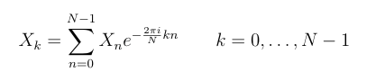
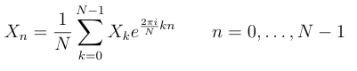
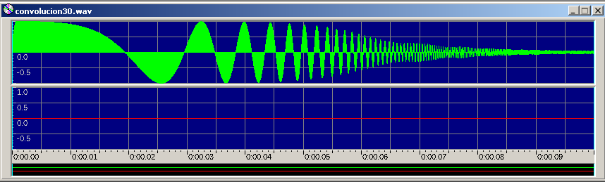

# Simulación de Circuito RC (En Frecuencia)

Filtro pasa bajas simulando un circuito RC, multiplicando las señales en la
frecuencia, lo que es equivalente a hacer la convolución en el tiempo.

Proceso:

1.- Aplicar la DFT a la señal que se aplicará el filtro pasa bajas.

2.- Aplicar la DFT a la respuesta al impulso.

3.- Multiplicar las señales en la frecuencia.

4.- Aplicar la IDFT al producto de las señales en frecuencia.  

**Ejecucion con script**
./scriptXX.sh

**Caracteristicas**

DFT con la fórmula (escalado al valor máximo y con perdida de información):

IDFT con la fórmula (aplicando aquí el promedio y no en la DFT)

La multiplicación (con perdida de información, sin escalar al valor máximo)

Respuesta al impulso h[i] (Se generó y se adaptó a un archivo wav manualmente): 

	h[i] = e^(-i * (2 * PI * Fc)/Fs)

Fc: Frecuencia de corte.

Fs: Frecuencia de muestro.

Ejemplo de ejecucion:

