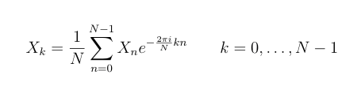

# Transformada de Fourier Discreta (DFT)

La Transformada de Fourier Discreta permite pasar un señal del tiempo 
a la frecuencia.

Implementado con la fórmula:

**Ejecutar**

./DFT [nombre wav entrada] [nombre wav salida]

Ejemplo de ejecucion: 

