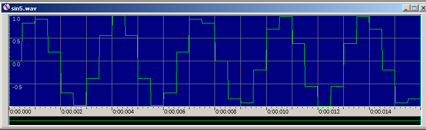
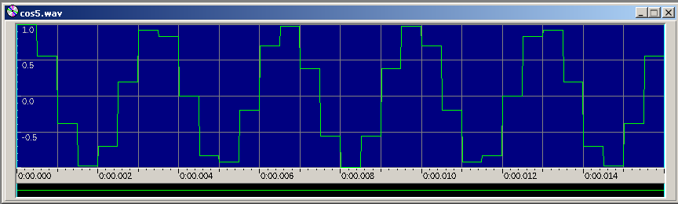

# Transformada de Fourier Discreta (DFT)

La Transformada de Fourier Discreta permite pasar un señal del tiempo 
a la frecuencia.

Implementado con la fórmula:

$ X_{k} = frac{1}{N}\sum_{n = 0}^{N - 1}X_{n} e^{ - frac{2PIi}{N} kn} K = 0, ... , N - 1$

**Ejecutar**

./DFT [nombre wav entrada] [nombre wav salida]

Ejemplo de ejecucion: 

