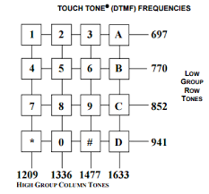

# DTMF (Dual-Tone Multi-Frequency) 

Es usado para la señalización de telecomunicaciones sobre líneas telefónicas 
analógicas en la banda de frecuencia vocal entre teléfonos u otros equipos 
de comunicaciones y la central telefónica.

Este práctica permite identificar dado un archivo wav que tecla se estría tocando.

