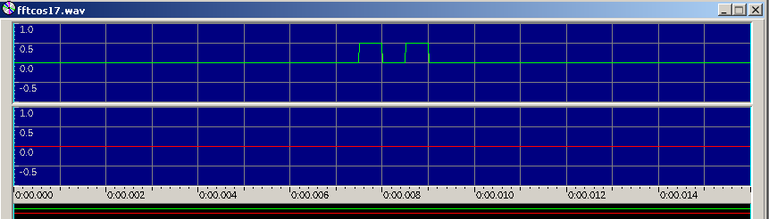
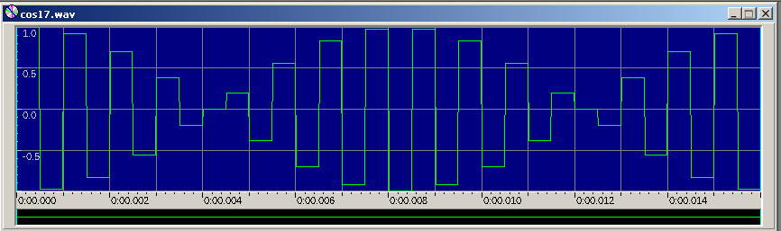

# Transformada Rápida de Fourier Inversa (IFFT)

La transformada rápida de Fourier Inversa es un algoritmo para pasar una señal
del dominio de la frecuencia al del tiempo con un orden de complejidad
N log N a diferencia de la IDFT que es cuadratica. 

**Ejecutar**
./IFFT [nombre wav entrada] [nombre wav salida]

