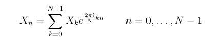

# Transformada Inversa de Fourier Discreta (IDFT)

Permite pasar una señal del dominio de la frecuencia al dominio del tiempo.

Considerando que el promedio se sacó en al DFT, (más información en el reporte)
se utilizó la fórmula:

**Ejecutar**
./IDFT [nombre wav entrada] [nombre wav salida]

Ejemplo de ejecucion: 

