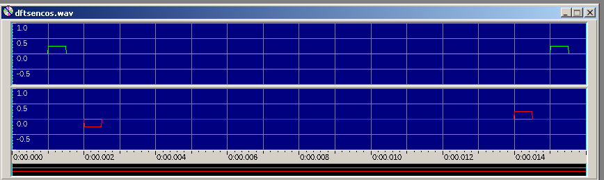

# Transformada Inversa de Fourier Discreta (IDFT)

Permite pasar una señal del dominio de la frecuencia al dominio del tiempo.

**Ejecutar**
./IDFT [nombre wav entrada] [nombre wav salida]

Ejemplo de ejecucion: 

