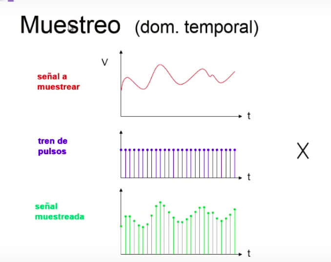
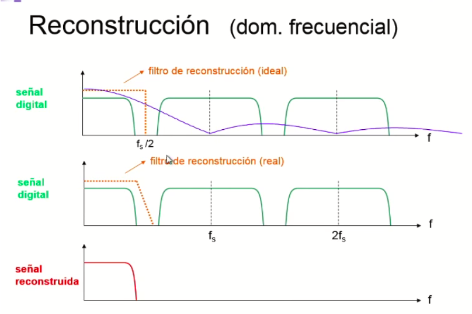
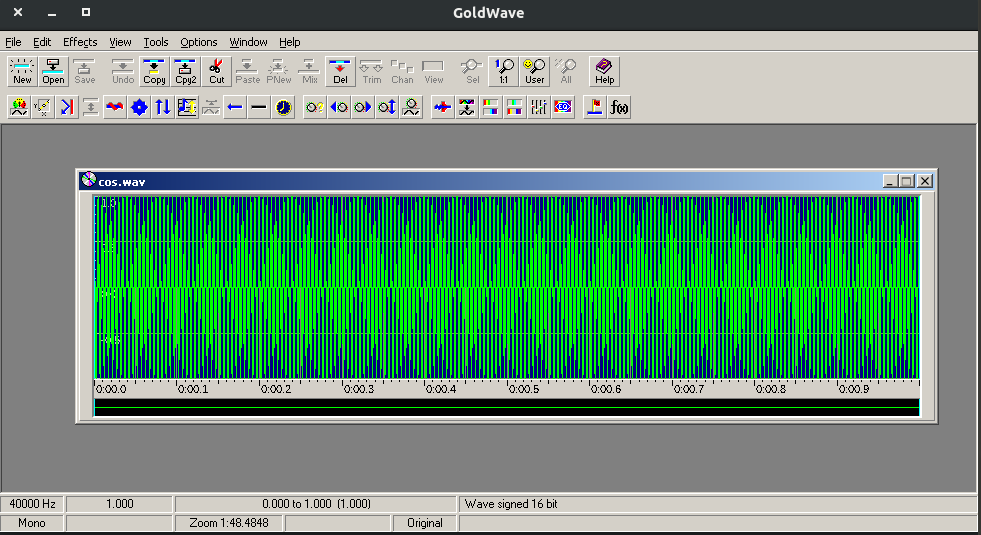
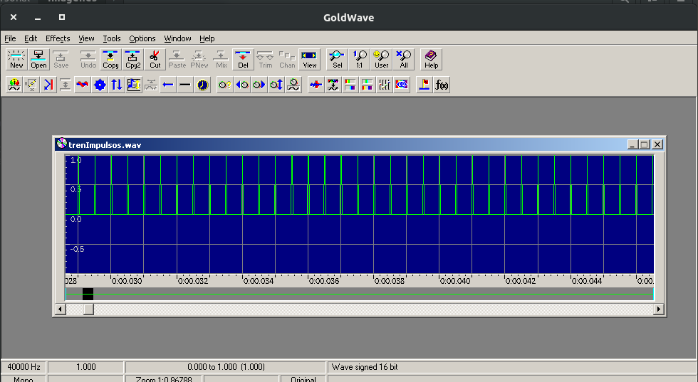
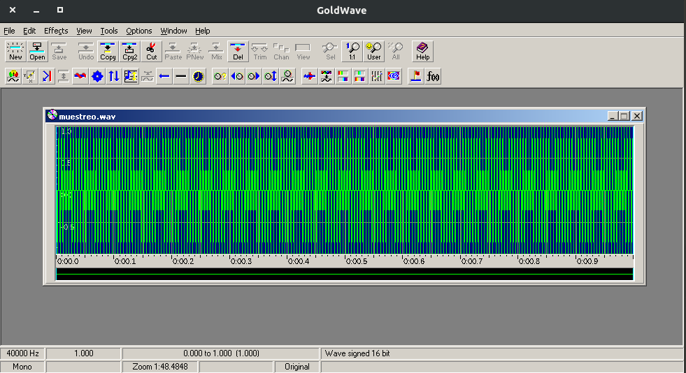
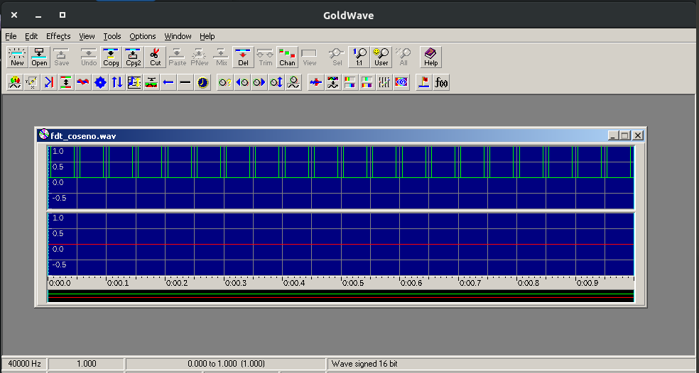
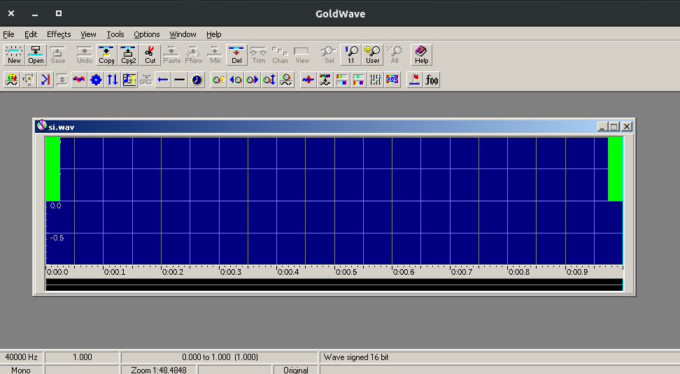
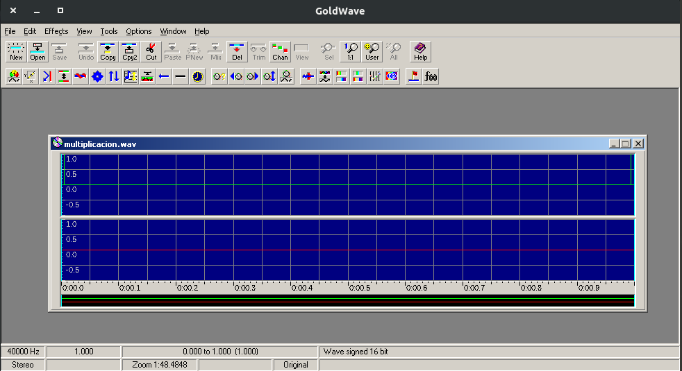
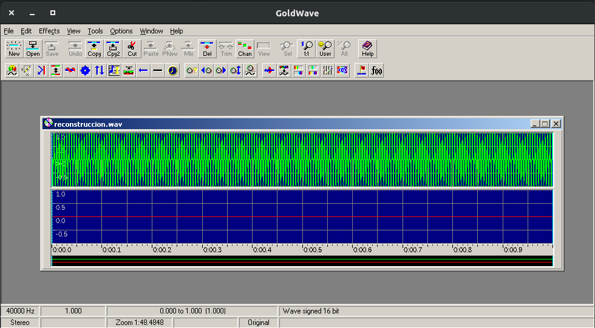

# Muestreo y Reconstrucción de una señal

De manera teorica una señal se muestrea multiplicando contra un tren de impulsos.

 

Para reconstruir una señal que fue muestreada, necesitamos pasarla al dominio de la
frecuencia y multiplicarla contra un filtro paso bajo ideal del fs/2.

Fs: Frecuencia de muestreo. 

 

Una vez multiplicada en la fecuencia aplicamos la IDFT. 

**Caracteristicas**

DFT con la fórmula (escalado al valor máximo y con perdida de información):

IDFT con la fórmula (aplicando aquí el promedio y no en la DFT)

La multiplicación (con perdida de información, sin escalar al valor máximo)

**Ejemplo de ejecución**

Señal

 

Tren de Impulsos

 

Señal muestreada

 

Señal muestreada en frecuencia

 

Filtro ideal

 

Multiplicación de filtro y señal en frecuencia

 

Señal reconstruida

 

Mas información: https://www.youtube.com/watch?v=nSGQ8fJjJUw

