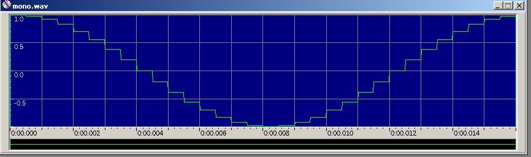
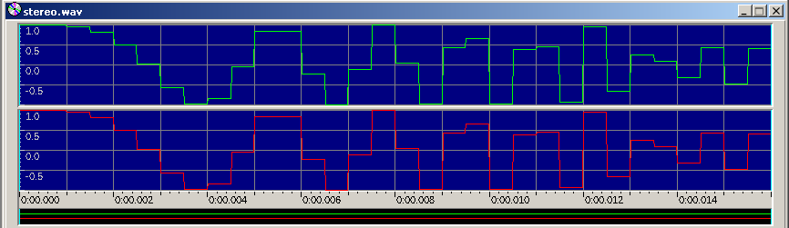
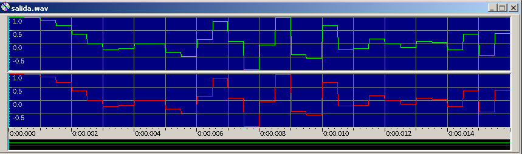

# Multiplicación de Señales

La multiplicación de señales es igual a la multiplicación de números imaginarios.
(Leer reporte)

**Ejecutar**
./Multiplicacion [nombre wav 1] [nombre wav 2] [nombre wav salida]

Ejemplo de ejecucion:

wav1

wav2

salida

