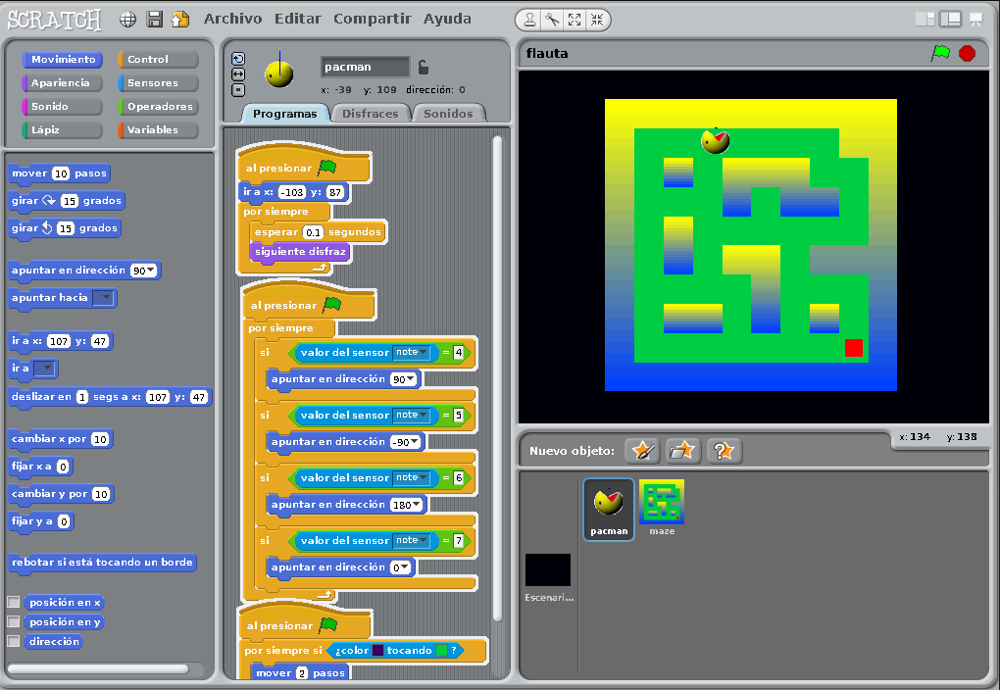
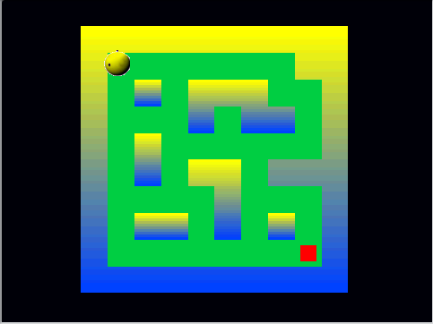
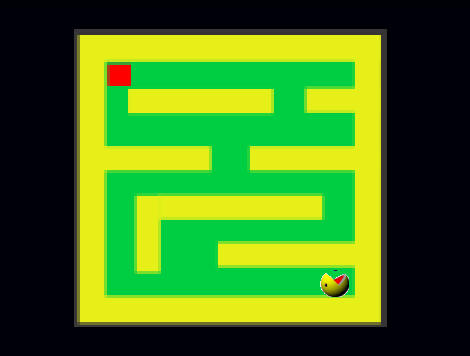

# Videojuego controlado con flauta

Este Videojuego hace uso de la biblioteca de ALSA para recivir audio y mediante la
Transformada de Fourier Discreta pasamos la señal del dominio del tiempo a la frecuencia
para detectar las notas musicales de la flauta, una vez detectadas se envia la información con sokets al servidor de scratch.

**Servidor de Scratch**
Abrir archivo flauta.sb en scratch.

**Cliente en lenguage C**
Ejecutar ./flauta.exe

Para volver a compilar:
gcc Flauta.c -o flauta.exe -lm -lasound

**Controles**

SI : Arriba
SOL: Izuierda
LA: Abajo
FA: Derecha

Ejemplo de ejecución:

