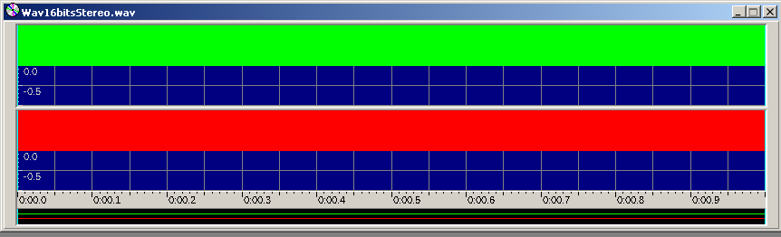
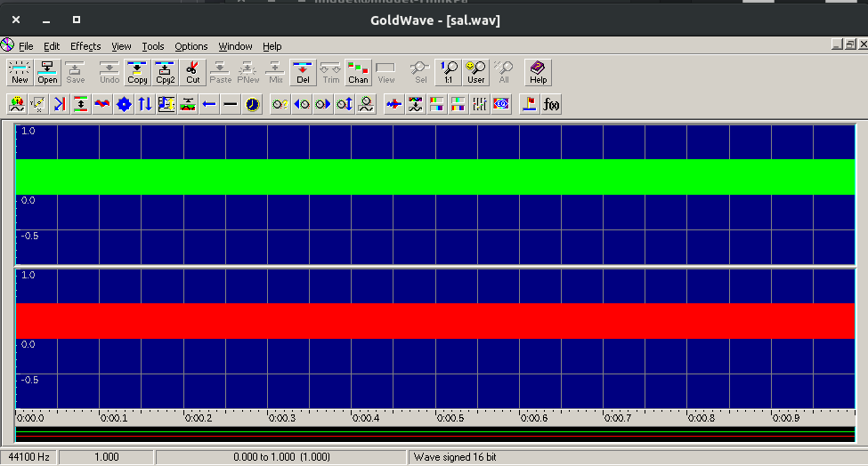
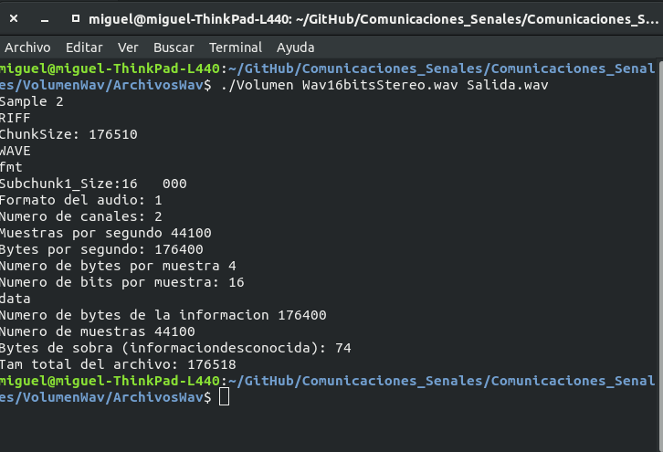

# Volumen 

Esta práctica permite reducir el volumen de un archivo wav al 50%.
Para entender el formato wav e introducir el manejo de señales.

**Ejecutar**
./Volumen [nombre wav entrada] [nombre wav salida]

Ejemplo de ejecución:

