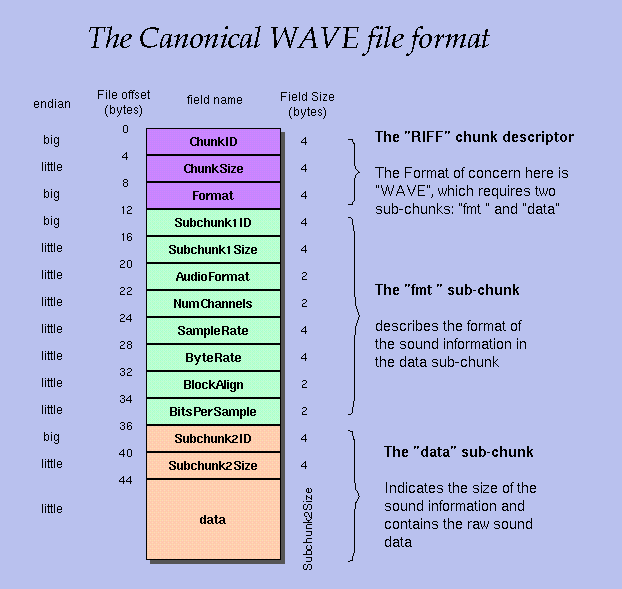

Biblioteca para manejar archivos wav.

Los archivos wav son un formato de audio normalmente sin compresión ideales
para prácticas de señales.

La informacion de la cabecera: http://soundfile.sapp.org/doc/WaveFormat/ 

